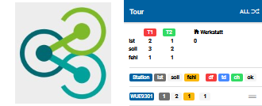

# sharee.bike Servicetool - rental bike service management



The sharee Servicetool - is a rental bike service management software:
It is build with the Ionic 3 Framework as PWA (Progressive Web App).

This PWA connects via REST API to the main System - the COPRI Database 
https://gitlab.com/t6353/sharee.bike

Running as a PWA it is installed on a normal Webserver. This way you can use it by Smartphone, Tablet or Laptopb/Desktop Client. For this App there is no need to load it from Google or Apple Store.

See the <a href="sharee-Servicetool-Handbuch.pdf" target=_blank/>User Manual</a>:  

## Installation Guide - Development Platform

1. [Ionic 3 Framework](#Ionic-3-Framework)
2. [Git lokal](#Git-lokal)
3. [Download from Remote Git](#Download-from-Remote-Git)
4. [Config File](#Config-File) (for Rest API)
5. [Start Ionic local](#Start-Ionic-local) 
6. [Build Production PWA](#Build-Production-PWA) 
7. [Hosting PWA](#Hosting-PWA) 
 

## Ionic 3 Framework

1. Install NodeJS  Version 8.9.1 
https://nodejs.org/download/release/v8.9.1/

Installation as exactly on a Windows System. For Unix is very similar.

2. Use the Node.js command promt to run the scripts:
```bash
npm -v
```
--> 5.5.1
```bash
npm install -g cordova@7.1.0
cordova -v
```
--> 7.1.0
```bash
npm install -g ionic@3.20.0
ionic -v   
```
--> 3.20.0


more documentation about Ionic 3:
https://ionicframework.com/docs/v3/

## Git lokal

make sure your lokal Git System ist installed.

## Download from Remote Git

Go to the directory you want to be the root directory and run the command:
```bash
git clone https://github.com/christian-fi/sharee-servicetool.git
```

### Config File

Build the Conig File (config-api.js) to connect to the Copri Rest API.<br>
In the root dir create a new directory named 'www'. <br>
Save config-api.js in dir 'www'.<br>
...
var config_api="OpenSource-Version"; //you can change this<br>

var version_akt= "1-0"; //you can change this<br>
var version_check_conf = "NO"; //do not change this<br>

// replace this vars with data for a sharee test account<br>
var shareeLive_conf="https://example1.org";  <br>
var apiVersion_conf = "https://example2.org";<br>
var apiMerchant_id_conf="12345";<br>
var apiUrl_conf="https://example3.org";<br>

Contact https://sharee.bike/Kontakt to get the data for a sharee test account


### Start Ionic local

Start build the Ionic App from the Sources an a lokal WebServer

```bash
ionic serve
```
important: say No ... to updating CLI
--> we have to use ionic CLI older version, do not update
say Y ... to creating node modules

this command builds the PWA in directory 'www' and automatically opens it in your local Browser 

## Build Production PWA 

to Build a Production PWA for Hosting on a Live-WebServer

```bash
npm run ionic:build -- --prod
```
### Hosting PWA

Copy the 'www' Directory with FTP as Web-Root Directory to your Web-Host.
